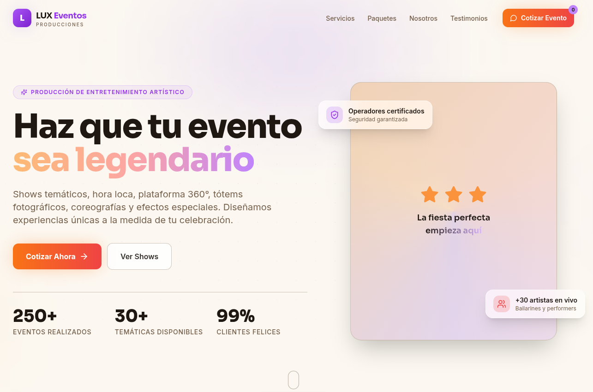

# LUX Eventos — Landing Page de Alta Conversión

Landing page moderna, interactiva y responsive para una empresa de producción de eventos y
entretenimiento artístico (shows temáticos, hora loca, plataforma 360°, tótems fotográficos,
coreografías y efectos especiales).

## Stack

| Capa | Tecnología |
| --- | --- |
| Framework | Astro (SSG) + islas React |
| Estilos | Tailwind CSS (dark premium, beige / morado / crema / naranja / rojo) |
| Islas interactivas | React (wizard de cotización y catálogo de servicios) |
| Sin JS | Navbar, Hero, Paquetes, Nosotros, Testimonios, Footer (vanilla + CSS) |
| Formularios | React Hook Form + Zod (solo se carga al abrir el cotizador) |
| Iconos | SVG inline (estático) + Lucide (islas) |
| Animaciones | CSS puro estilo Apple: curvas con overshoot (sheets), feedback instantáneo al presionar, dirección en los pasos del wizard |
| Estado global | `window.__spaBasket` + CustomEvents (compartido entre islas y vanilla) |

## Inicio rápido

```bash
npm install
npm run dev       # http://localhost:4321
npm run build     # build estático + generación de tipos
npm run preview   # sirve el build
npm run check     # astro check (tipos)
npm run verify    # smoke test con Chrome headless (requiere npm run preview)
```

## Estructura de carpetas

```
LUX-Eventos/
├── astro.config.mjs
├── postcss.config.js
├── tailwind.config.ts       # paleta: night (fondo morado), cream, beige + gradientes
├── scripts/
│   └── verify.mjs           # smoke test end-to-end (puppeteer-core)
└── src/
    ├── Layout.astro         # shell (SEO, fuentes) + scripts globales
    ├── global.css           # base Tailwind + reveals CSS y prefers-reduced-motion
    ├── config.ts            # Marca, WhatsApp, IGV, tipos de evento, links
    ├── types/index.ts       # Interfaces y tipos estrictos
    ├── data/
    │   ├── services.ts      # Catálogo de servicios
    │   ├── packages.ts      # Paquetes comparativos
    │   ├── social.ts        # Testimonios y marcas aliadas
    │   └── categories.ts    # Filtros del catálogo
    ├── lib/
    │   ├── quote.ts         # Schemas Zod + cálculo de cotización
    │   ├── whatsapp.ts      # Construcción del mensaje y envío (WhatsApp / API)
    │   ├── format.ts        # Formateadores de moneda y fecha
    │   ├── icons.ts         # Registro de iconos Lucide (islas React)
    │   ├── basket.ts        # Puente de estado global (CustomEvents)
    │   └── useMultiStepForm.ts
    ├── pages/
    │   └── index.astro      # Compone todas las secciones
    └── components/
        ├── Icon.astro       # SVG inline reutilizables (secciones estáticas)
        ├── SectionHeading.astro
        ├── Navbar.astro / Hero.astro / Packages.astro / About.astro
        ├── Testimonials.astro / Brands.astro / Footer.astro / WhatsAppButton.astro
        ├── Services.tsx     # Isla React: filtros + modal + toggle a cotización
        ├── ServiceModal.tsx # Modal de detalle de servicio
        └── quote/           # Wizard de cotización (isla React, 4 pasos)
```

## Arquitectura de islas y estado

El estado de selección vive en `window.__spaBasket` (`{ packageId, addons }`) y se sincroniza
mediante dos CustomEvents:

- `spa:basket` → lo escuchan el navbar (badge) y las islas React para refrescar selección.
- `spa:open-quote` → lo dispara cualquier CTA `[data-open-quote]` del HTML estático; la isla
  `QuoteWizard` escucha y abre el cotizador con los presets del basket.

Los botones `data-open-quote` (navbar, hero, paquetes, footer, menú móvil) usan delegation en
`Layout.astro`, por lo que no cargan React.

## Personalización

Edita `src/config.ts`:

- `WHATSAPP_NUMBER`: número destino del cotizador y del botón flotante.
- `QUOTE_API_ENDPOINT`: URL que recibe `POST` con `{ quote, message, submittedAt }` (vacío = desactivado).
- `COMPANY_INFO`, `EVENT_TYPES`, `IGV_RATE`.

Contenido editable en `src/data/`: `services.ts`, `packages.ts`, `social.ts`.
Paleta y gradientes en `tailwind.config.ts`.

## Accesibilidad

- Roles `dialog` / `aria-modal` con cierre por `Escape` y bloqueo de scroll.
- `aria-label` en botones de icono, `aria-pressed` en toggles, `aria-current="step"` en el wizard.
- Errores de formulario anunciados con `role="alert"` y `focus` gestionado por React Hook Form.
- Soporte de `prefers-reduced-motion` y navegación por teclado con `focus-visible`.


